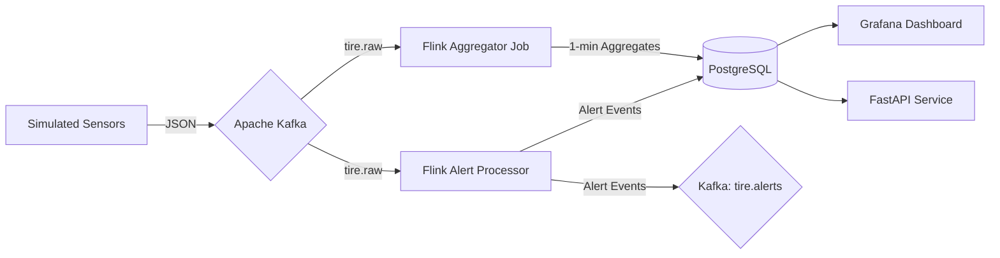

# Tire Management System - Real-time Monitoring Pipeline

## 📖 Project Overview
This project implements a real-time data processing pipeline for monitoring tire sensors (pressure and temperature) across a fleet of vehicles. It ingests raw sensor data, processes it for anomalies (alerts), and aggregates statistics for reporting.

The system is designed to be scalable, fault-tolerant, and easy to deploy using containerization.

## 🏗️ Architecture
The pipeline follows a modern streaming architecture:



### Data Flow
1.  **Ingestion**: Raw sensor data is published to the `tire.raw` Kafka topic.
2.  **Processing**:
    *   **Aggregator**: Computes 1-minute tumbling windows (Avg/Min/Max Pressure & Temperature) and stores them in the `tire_aggregations` table.
    *   **Alert Processor**: Checks for thresholds (Pressure < 200 kPa, Temp > 90°C). Alerts are stored in `tire_alerts` and published to `tire.alerts`.
3.  **Visualization**: Grafana queries PostgreSQL to display real-time charts and status overviews.

## 🛠️ Technology Stack

| Component | Technology | Why it was chosen |
|-----------|------------|-------------------|
| **Message Broker** | **Apache Kafka** | Handles high-throughput sensor data ingestion and decouples producers from consumers. |
| **Stream Processing** | **Apache Flink (PyFlink)** | Provides low-latency, stateful processing with powerful windowing capabilities for time-series aggregations. |
| **Database** | **PostgreSQL** | Robust relational database for storing structured historical data and alerts. |
| **Visualization** | **Grafana** | Industry-standard for observability; connects natively to Postgres to visualize time-series data. |
| **API** | **FastAPI** | Modern, high-performance Python framework for exposing data to external applications. |
| **Orchestration** | **Docker Compose** | Simplifies local development and deployment by managing all services in a single stack. |

## 🚀 Getting Started

### Prerequisites
*   Docker & Docker Compose installed on your machine.

### Installation & Running
1.  **Clone the repository** (if applicable) and navigate to the project root.

2.  **Start the services**:
    ```bash
    docker compose up --build -d
    ```
    *This starts Kafka, Zookeeper, Flink (JobManager/TaskManager), PostgreSQL, Grafana, and MinIO.*

3.  **Submit Flink Jobs**:
    The Flink jobs need to be submitted to the cluster. Run the following commands:

    ```bash
    # Submit Aggregator Job
    docker exec flink-jobmanager ./bin/flink run -d -py /opt/flink/jobs/aggregator.py

    # Submit Alert Processor Job
    docker exec flink-jobmanager ./bin/flink run -d -py /opt/flink/jobs/alert_processor.py
    ```

4.  **Verify Running Jobs**:
    Visit the Flink Dashboard at [http://localhost:8082](http://localhost:8082) to see the running jobs.

## 📊 Dashboards & Access

| Service | URL | Credentials (if any) |
|---------|-----|----------------------|
| **Grafana** | [http://localhost:3000](http://localhost:3000) | User: `admin` / Pass: `admin123` |
| **Flink Dashboard** | [http://localhost:8082](http://localhost:8082) | N/A |
| **Kafdrop (Kafka UI)**| [http://localhost:9004](http://localhost:9004) | N/A |
| **FastAPI Docs** | [http://localhost:8000/docs](http://localhost:8000/docs) | N/A |

### Grafana Dashboard
A pre-configured dashboard "Tire Alerts" is available.
*   **Real-time Pressure/Temp**: Time-series visualization.
*   **Alert Distribution**: Breakdown of alert types.
*   **Vehicle Status**: Count of active vehicles.

## 🔧 Troubleshooting

### Common Issues
*   **Grafana "SSL is not enabled"**: This has been fixed via provisioning. If it recurs, ensure the Postgres data source has `SSL Mode: disable`.
*   **"Data is missing a number field"**: In Grafana Stat panels, ensure your SQL query casts counts to integers (e.g., `count(*)::int`).
*   **Flink Resource Errors**: If jobs fail with `NoResourceAvailableException`, ensure the `flink-taskmanager` in `docker-compose.yml` has enough slots (currently set to 4) and memory.

## 📂 Project Structure
*   `flink-python/`: PyFlink job scripts (`aggregator.py`, `alert_processor.py`) and Dockerfile.
*   `api/`: FastAPI application code.
*   `grafana/`: Provisioning configs for data sources.
*   `docker-compose.yml`: Service orchestration definition.
*   `init-db.sql`: Database schema initialization.
